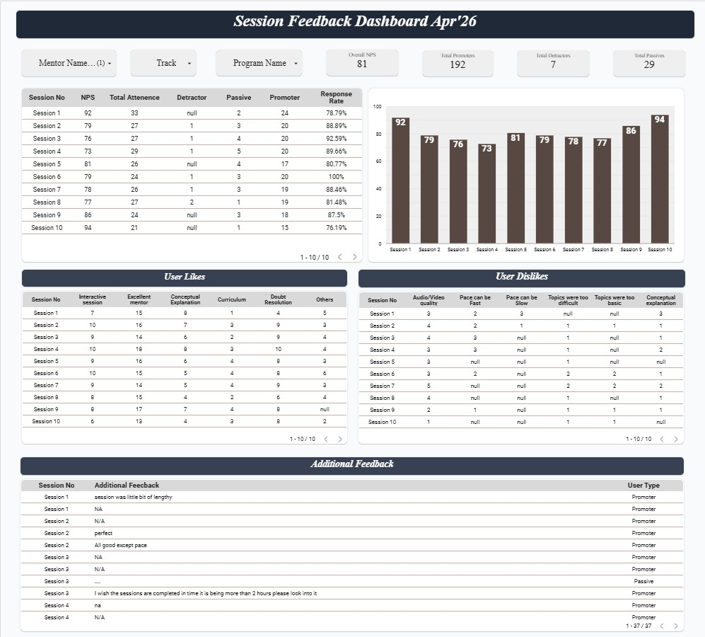
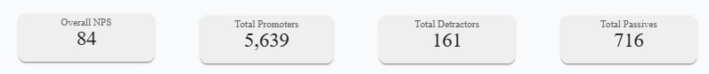
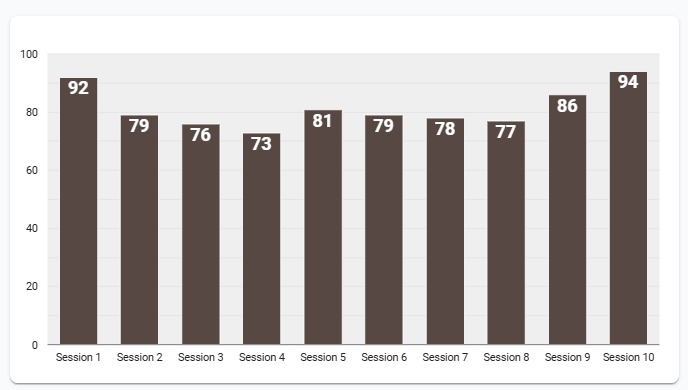

# Mentor Performance & Program Analytics Dashboard

## 📊 Overview
This project focuses on analyzing mentor performance and program KPIs using Looker Studio.

## 📈 Key Metrics
- Session adherence  
- Mentor performance scores  
- NPS (Net Promoter Score)  
- Attendance tracking  

## 🛠 Tools Used
- Google Sheets  
- Looker Studio  

## 🎯 Objective
To improve program efficiency by identifying performance gaps and enabling data-driven decision-making.

## 🚀 Outcome
Enabled real-time performance tracking and reduced manual reporting efforts.

## 📸 Dashboard Preview

### 🔹 Overview

### 🔹 Key Metrics

### 🔹 Insights

Note: This project is based on real-world program analytics use cases. All data shown is anonymized and for demonstration purposes only.
